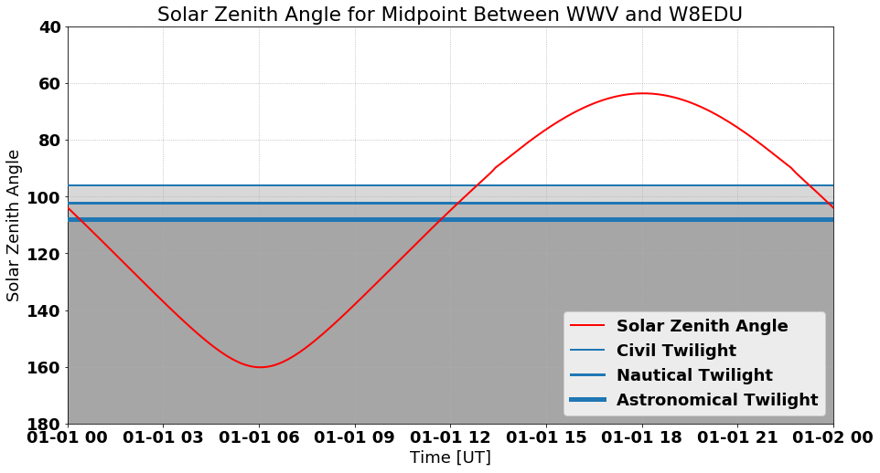

# solar_zenith
Computes Solar Zenith Angle and Lat/Lon Math

This package will compute solar zenith angle and includes a copy of the geopack for doing latitude/longitude math. An example is given in `Solar Zenith Angle.ipynb`.

This can be install in-place as an editable install: `pip install -e .`

